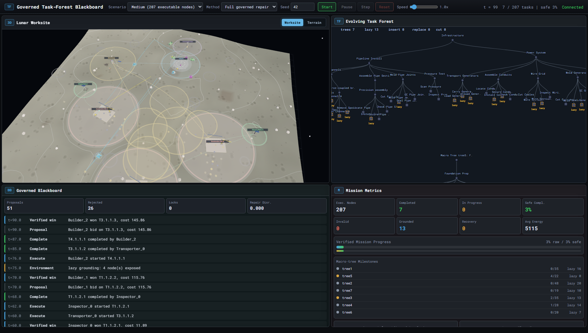
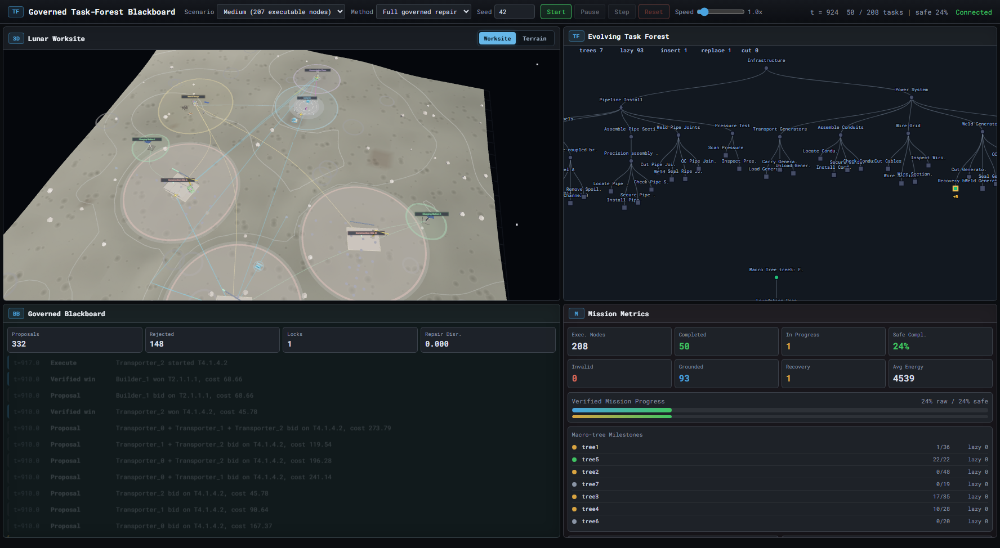
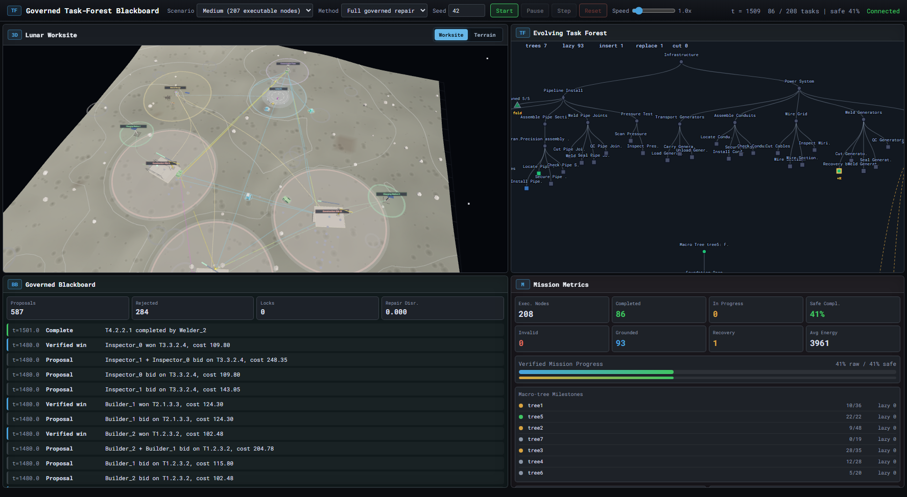
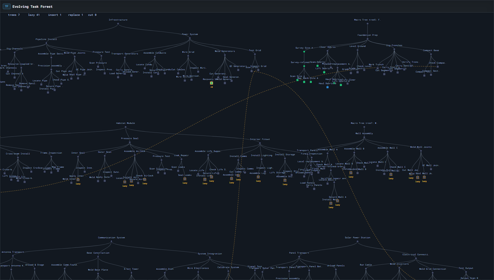
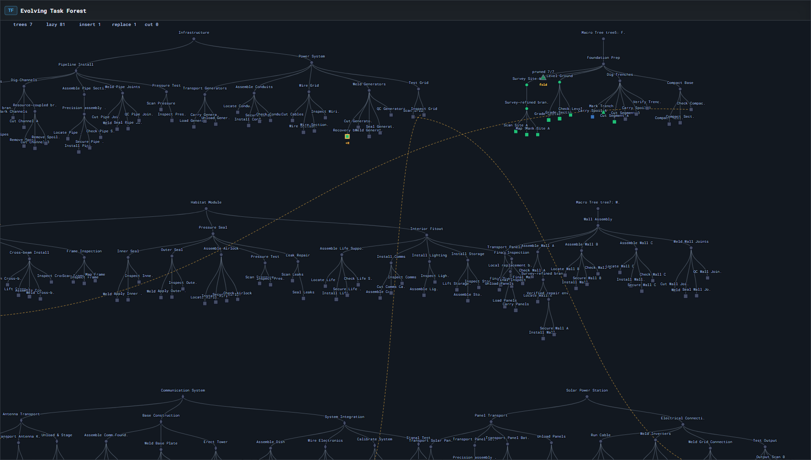
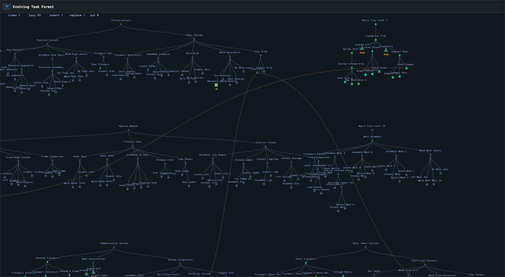
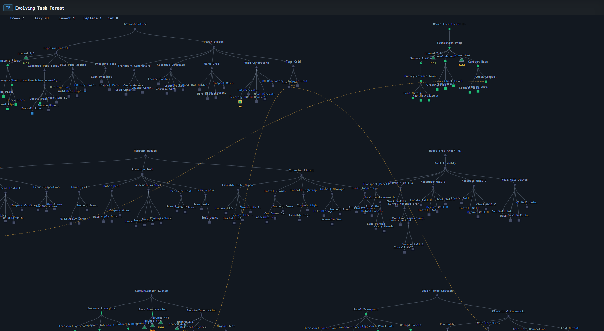

# Governed Task-Forest Blackboard

**A Governed Task-Forest Blackboard Framework for Verifiable Long-Horizon Multi-Robot Execution**

This page is a lightweight public showcase for reviewers. The full source code and experimental scripts are kept private during review to protect unpublished implementation details.

## Dashboard Progression

The dashboard combines the 3D lunar worksite, the evolving task forest, governed blackboard events, and mission metrics. The frames below are representative snapshots from one medium-scenario run.

## Evolving Task Forest Frames

The task forest is not a static tree. During execution, lazy nodes become grounded, recovery branches are inserted, local replacements appear, and completed subtrees are folded or marked.

Individual high-resolution frames

### Full Dashboard Frames

### Task Forest Frames

## What This Demonstrates

- A long-horizon lunar construction mission with a heterogeneous robot team.
- An evolving task forest with delayed grounding, recovery insertion, branch replacement, and bounded local repair.
- A governed blackboard that records proposal, verification, commitment, resource, and repair events.
- A Three.js worksite dashboard showing terrain, zones, robot state, task-frontier evolution, and mission metrics.

## Review Artifact Scope

This public artifact intentionally includes only a visual demonstration and high-level method summary. It does not include:

- simulator source code,
- task-forest generation code,
- governed blackboard implementation,
- verifier and repair algorithms,
- full experiment scripts.

The complete implementation is maintained in a private repository during review and can be shared with reviewers through a controlled artifact channel if required.

## Paper Summary

The framework represents a long-horizon multi-robot mission as an evolving task forest. Online observations are projected into a governed blackboard, and decision modules may only submit typed proposals. Each proposal is verified before it can atomically update the task forest and blackboard. When faults, blocked regions, or delayed grounding events invalidate a branch, the system repairs only the affected subforest while preserving protected work outside that region.

## Contact

Repository owner: `whosthereme`
